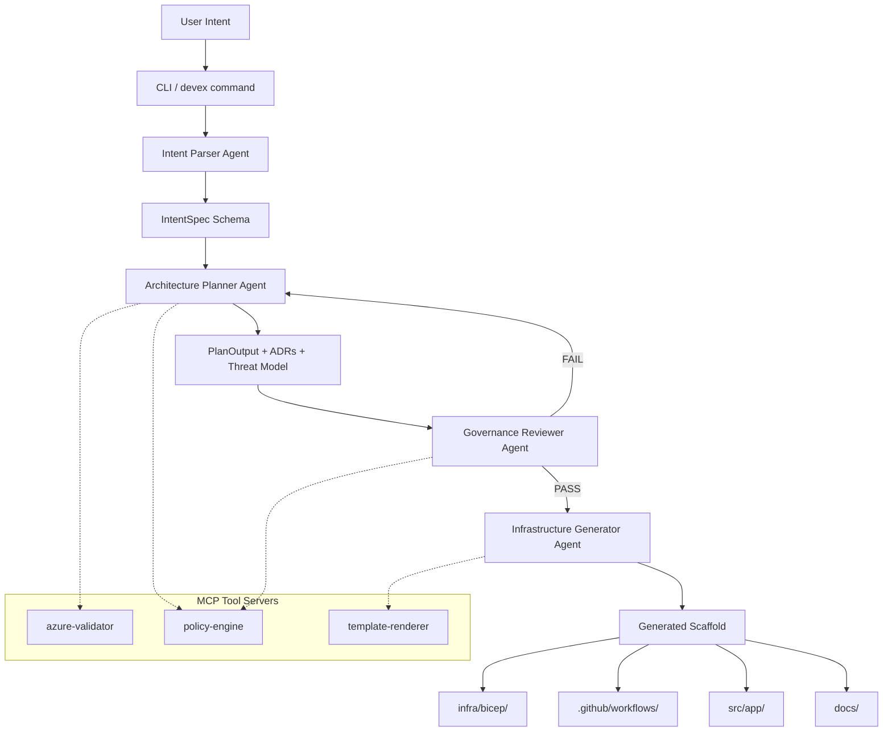
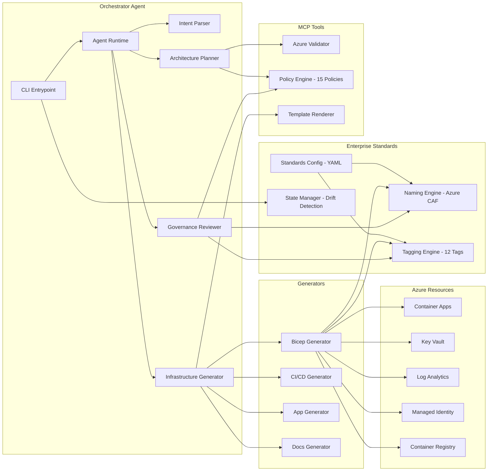
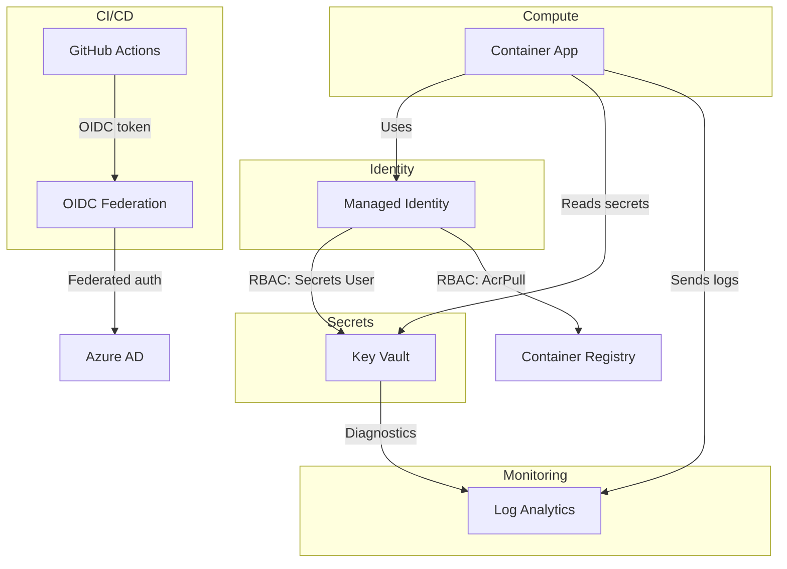

# Architecture Overview

> Enterprise DevEx Orchestrator Agent -- System Architecture

## High-Level Flow

## Component Architecture

## Data Flow

| Stage | Input | Processing | Output |
|-------|-------|-----------|--------|
| 1. Parse | Plain-text intent | LLM structured extraction + rule-based fallback | `IntentSpec` |
| 2. Plan | `IntentSpec` | Component selection, ADR generation, STRIDE threat model | `PlanOutput` |
| 3. Review | `IntentSpec` + `PlanOutput` | 15-policy validation, naming/tagging standards check, security scanning | `GovernanceReport` |
| 4. Generate | `IntentSpec` + `PlanOutput` + `GovernanceReport` | Template rendering, Azure CAF naming, enterprise tagging, file generation | File tree |
| 5. Record | Generated files | SHA-256 file manifest, drift detection, audit trail | `.devex/state.json` |

## Security Architecture

## Design Principles

1. **Deterministic Structure**: File layout, naming, and module organization are always the same
2. **Controlled Variability**: LLM adds context-specific content within deterministic boundaries
3. **Governance by Default**: Every scaffold passes governance validation before output
4. **Defense in Depth**: Multiple security layers -- identity, encryption, networking, scanning
5. **Observable from Day 1**: Log Analytics and diagnostics configured for all resources
6. **Enterprise Standards**: Azure CAF naming conventions and enterprise tagging enforced via YAML config
7. **State Awareness**: Every generation is tracked with drift detection between runs
