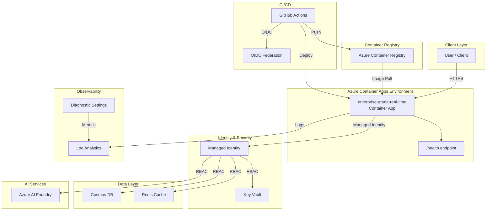

# Architecture Plan: enterprise-grade-real-time

> Enterprise-grade api workload deployed on Azure Container Apps with managed identity, Key Vault secret management, Log Analytics observability, and private networking. CI/CD via GitHub Actions with OIDC authentication.

## Intent

```
An enterprise-grade, real-time voice-to-voice agent system for Demo Health System (Demo) healthcare operations. Built with OpenAI's GPT-4o Realtime API for natural conversational experiences, backed by Azure Container Apps, Cosmos DB for session history, Redis for low-latency caching, and HIPAA-compliant infrastructure. Problem Statement: Demo Health System clinical and administrative staff spend significant
time on manual phone workflows -- appointment scheduling, prescription refill
requests, post-discharge follow-ups, and insurance eligibility checks. Patients
wait on hold an average of 8 minutes, and after-hours calls go to voicemail
with next-business-day callbacks. Front-desk staff handle ~1,200 calls/day
across 14 clinics, leading to burnout and a 22% annual turnover rate. HIPAA
compliance requires every patient interaction to be logged and access-controlled,
but the current phone system has no structured audit trail. The cost of missed
and delayed callbacks is estimated at $2.4M/year in patient churn and
re-scheduling overhead. Business Goals: - Reduce average patient wait time from 8 minutes to under 30 seconds via AI voice agent
- Automate 60% of routine calls (scheduling, refills, FAQs) without human handoff
- Achieve HIPAA audit readiness for all voice interactions by end of quarter
- Decrease front-desk call volume by 50%, reducing staff burnout and turnover
- Provide 24/7 voice agent availability -- eliminating after-hours voicemail
- KPI: Patient satisfaction (CSAT) score above 4.2/5.0 within 6 months of launch
- KPI: Average handle time for automated calls under 90 seconds Target Users: - **Patient** -- calls to schedule appointments, request refills, ask billing questions; low technical proficiency, expects natural conversation
- **Front-Desk Coordinator** -- monitors live agent dashboard, handles escalations; intermediate technical proficiency
- **Clinical Staff (Nurse/PA)** -- receives escalated calls with context summary; intermediate technical proficiency
- **IT Administrator** -- manages voice agent configuration, monitors uptime and HIPAA compliance; high technical proficiency
- **Compliance Officer** -- reviews call audit logs and PHI access reports weekly; low technical proficiency Functional Requirements: - Real-time voice-to-voice conversations using OpenAI GPT-4o Realtime API (WebSocket-based)
- REST API for session management: create session, list sessions, get transcript, end session
- Appointment scheduling: check provider availability, book/cancel/reschedule via API integration
- Prescription refill: validate patient identity, submit refill request to pharmacy system
- FAQ handling: answer common questions about locations, hours, insurance, and procedures
- Escalation to human agent with full conversation context and transcript handoff
- Cosmos DB storage for session metadata, transcripts, and interaction history
- Redis caching for provider schedules, FAQ responses, and active session state
- Role-based access: admin (full), coordinator (dashboard + escalation), clinician (read transcripts), auditor (read audit logs)
- Audit log for every voice interaction: caller ID, timestamp, intent, outcome, PHI access flags
- Webhook notifications on escalation events and failed interactions Scalability Requirements: - 500 concurrent voice sessions during peak hours (8am-6pm across 14 clinics)
- 200 new sessions/minute sustained, 500/minute burst (Monday mornings)
- Initial data volume: 50,000 session records/month (~20 GB Cosmos DB)
- Growth: 30% year-over-year as clinics onboard and patient adoption increases
- Single region initially (eastus2), with multi-region readiness in architecture
- Auto-scale from 3 to 15 container instances based on active WebSocket connections Security & Compliance: - Authentication: Azure AD (Entra ID) via managed identity for service-to-service, OAuth2 for staff dashboard
- Authorization: RBAC with 4 roles (admin, coordinator, clinician, auditor) enforced at API layer
- Data classification: PHI (Protected Health Information) by default, de-identified for analytics
- Encryption: TLS 1.2+ in transit (including WebSocket), AES-256 at rest (platform-managed keys)
- Network: Private endpoints for Cosmos DB and Redis, no public internet access to data stores
- Compliance frameworks: HIPAA (BAA required with Azure), SOC2 Type II
- Secret management: Azure Key Vault with RBAC access policy, soft delete, purge protection
- No secrets in code, config, or CI/CD -- all via managed identity or Key Vault references
- PHI access logging: every read/write of patient data logged with user identity and justification
- Voice data retention: configurable retention period (default 90 days) with automated purge Performance Requirements: - Voice latency: p50 < 300ms, p95 < 600ms, p99 < 1s (end-to-end voice round-trip)
- API response latency: p50 < 100ms, p95 < 300ms, p99 < 1s (REST endpoints)
- Session creation latency: p95 < 2s (including WebSocket handshake and GPT-4o connection)
- Transcript retrieval: p95 < 500ms for sessions up to 30 minutes
- Availability SLA: 99.9% uptime during business hours, 99.5% after-hours
- RTO: 2 hours, RPO: 30 minutes (geo-redundant Cosmos DB)
- Cold start time: < 5 seconds for container instances (WebSocket readiness) Integration Requirements: - Upstream: Azure AD for authentication, hospital EHR system (HL7 FHIR R4) for patient lookup
- Upstream: OpenAI GPT-4o Realtime API for voice-to-voice inference (WebSocket)
- Downstream: Pharmacy system API for refill submissions, scheduling system for appointment CRUD
- Third-party: Twilio or Azure Communication Services for telephony/SIP trunk integration
- Event-driven: Escalation events trigger notification to coordinator dashboard via Event Grid
- Monitoring: Application Insights for telemetry, Log Analytics for HIPAA audit queries Acceptance Criteria: - Voice agent responds naturally within p95 latency targets for end-to-end conversation
- Session CRUD endpoints return correct HTTP status codes and JSON responses
- RBAC enforcement: clinician cannot delete sessions, auditor cannot modify transcripts -- verified by integration tests
- Audit log captures 100% of voice interactions with correct PHI access metadata
- Escalation hands off full transcript and intent summary to human coordinator
- Appointment scheduling integration correctly queries and books available slots
- Infrastructure deploys successfully via `az deployment group create` with zero manual steps
- CI/CD pipeline passes: lint, unit tests, integration tests, security scan (CodeQL), Bicep validation
- Governance validation passes with no FAIL status
- HIPAA-required controls (access control, audit logging, encryption at rest, PHI access logs) are demonstrably present Application type: api. Data stores: cosmos, redis. Azure region: eastus2. Environment: dev. Authentication: managed-identity. Compliance framework: HIPAA.
```

## Executive Summary

Enterprise-grade api workload deployed on Azure Container Apps with managed identity, Key Vault secret management, Log Analytics observability, and private networking. CI/CD via GitHub Actions with OIDC authentication.

## Components

| Component | Azure Service | Purpose | Bicep Module |
|-----------|--------------|---------|-------------|
| container-app | Azure Container Apps | Hosts the api application with auto-scaling | `container-app.bicep` |
| key-vault | Azure Key Vault | Centralized secret and certificate management | `keyvault.bicep` |
| log-analytics | Azure Log Analytics | Centralized logging, monitoring, and diagnostics | `log-analytics.bicep` |
| managed-identity | Azure Managed Identity | Passwordless authentication between Azure resources | `managed-identity.bicep` |
| container-registry | Azure Container Registry | Private container image registry for application images | `container-registry.bicep` |
| cosmos-db | Azure Cosmos DB | NoSQL database for application data | `cosmos-db.bicep` |
| redis-cache | Azure Redis Cache | In-memory cache for low-latency data access and session management | `redis.bicep` |


## Architecture Diagram



## Architecture Decision Records


### ADR-001: Use Azure Container Apps for compute

- **Status:** Accepted
- **Context:** Need a managed container platform that supports auto-scaling, managed identity, and integrated logging without Kubernetes operational overhead.
- **Decision:** Selected Azure Container Apps over AKS and App Service. Container Apps provides Kubernetes-based scaling with a serverless operational model.
- **Consequences:** Simpler operations than AKS. Some limitations on advanced networking compared to AKS. Acceptable for this workload.

### ADR-002: Use Managed Identity for all service-to-service auth

- **Status:** Accepted
- **Context:** Enterprise security policy requires passwordless authentication. Credential rotation and secret sprawl are operational risks.
- **Decision:** All Azure resource access uses User-Assigned Managed Identity with least-privilege RBAC roles.
- **Consequences:** Eliminates credential management. Requires proper role assignments in Bicep. Slightly more complex initial setup.

### ADR-003: Use Bicep for Infrastructure as Code

- **Status:** Accepted
- **Context:** Need Azure-native IaC that supports ARM validation, what-if analysis, and integrates with az CLI.
- **Decision:** Selected Bicep over Terraform for Azure-native tooling, no state file management, and direct ARM integration.
- **Consequences:** Azure-only (acceptable for this scope). Native az deployment group validate support.

### ADR-004: Use Key Vault for all secrets

- **Status:** Accepted
- **Context:** No secrets should be stored in code, environment variables, or CI/CD configuration directly.
- **Decision:** All secrets stored in Azure Key Vault. Application accesses them via Managed Identity. CI/CD uses OIDC.
- **Consequences:** Additional Key Vault resource cost. Requires proper access policies. Eliminates secret exposure risk.

### ADR-005: Private ingress by default

- **Status:** Accepted
- **Context:** Enterprise workloads should not be publicly accessible unless explicitly required.
- **Decision:** Container Apps environment configured with internal ingress. External access requires explicit configuration.
- **Consequences:** Requires VNet integration for access. More secure by default. May need adjustment for public-facing APIs.

### ADR-006: Use Azure AI Foundry for AI/ML integration

- **Status:** Accepted
- **Context:** Workload requires AI capabilities. Need enterprise-grade AI platform with content safety and monitoring.
- **Decision:** Use Azure AI Foundry (formerly Azure AI Studio) for model hosting and inference, with content safety filters enabled.
- **Consequences:** Requires Azure AI Foundry resource provisioning. Content safety may filter edge cases. Provides audit trail.


## Assumptions

- Using Python + fastapi as application stack
- Azure Container Apps as compute target
- Managed Identity for authentication
- Key Vault for secret management
- Log Analytics for observability

## Open Risks

- Intent may require clarification for complex architectures

## Agent Confidence

**Confidence Level:** 75%

---
*Generated by Enterprise DevEx Orchestrator Agent*
